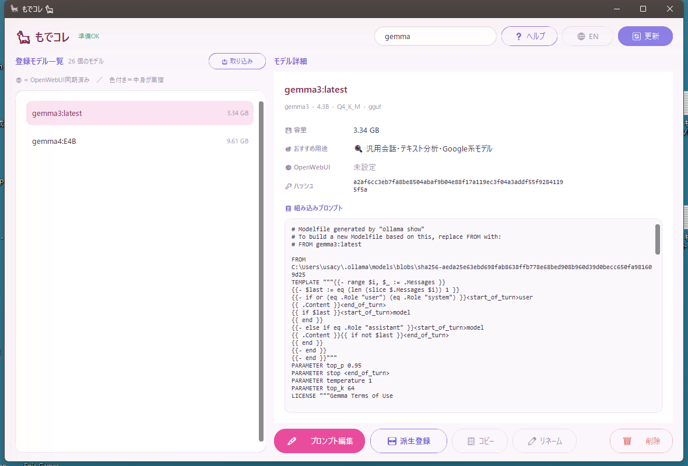
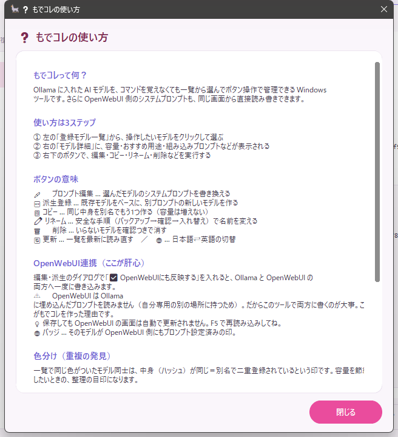

# もでコレ 🦙

<p align="center"><b>日本語</b> ｜ <a href="README_EN.md">English</a></p>

**Ollama のモデルを、マウス操作だけで管理できる Windows 用の GUI ツール**です。
黒い画面（コマンド）を覚えなくても、一覧から選んでボタンを押すだけで、
モデルの **一覧・詳細確認・削除・コピー・名前変更・プロンプト編集** ができます。

さらに——

- 🌐 **OpenWebUI** にも同じプロンプトをワンクリックで反映（後述の「プロンプトが効かない問題」を解決）
- 📥 **LM Studio** でダウンロードしたモデルを取り込んで一覧に追加
- 🎨 中身が同じ**重複モデル**を色分けで一目で発見



---

## 30秒で試す（クイックスタート）

> 前提：**Python** と **Ollama** が入っていること（→ 詳しくは [導入のしかた](#導入のしかた)）

1. コマンドプロンプトで `pip install customtkinter` を **一度だけ** 実行
2. `run.bat` を **ダブルクリック** で起動
3. 左の一覧から **モデルを1つクリック** → 右に詳細（容量・おすすめ用途・組み込みプロンプト）が出ます
   — これだけでも、各モデルの中身がひと目で読めます
4. あとは右下のボタンで、**コピー・名前変更・プロンプト編集** などが自由に

コマンドは一切打ちません。

> 💡 使い方に迷ったら、いつでもヘッダーの **「❓ ヘルプ」** ボタン。アプリの中に説明が出ます（日本語／英語）。
>
> 

---

## なぜ作ったの？ —「プロンプト設定したのに…なんで効かないの？」🤔

Ollama でモデルのシステムプロンプトを書き換えて、OpenWebUI で開いたら **まったく反映されていない** ——
そんな経験、ありませんか？　気のせいじゃありません。

OpenWebUI（v0.4 以降）は、Ollama のモデルに埋め込まれたシステムプロンプトを読みません。
**自分専用の場所（データベース）に、別のコピー**を持っているからです。
だから、せっかく書いたプロンプトは Ollama の中で眠ったまま。

ボク自身、これで一晩溶かしました。AI チャットに聞いても、本当の原因にたどり着けませんでした。
だから作ったのが **もでコレ** 🦙 ——
システムプロンプトを **Ollama と OpenWebUI の両方へ、ボタン1つで**書き込めるようにしました。
設定したものが、そのまま効く。

---

## 目次

- [どんなことができる？](#どんなことができる)
- [動作に必要なもの](#動作に必要なもの)
- [導入のしかた](#導入のしかた)
- [起動のしかた](#起動のしかた)
- [画面の見方](#画面の見方)
- [ボタンの使い方](#ボタンの使い方)
- [LM Studio のモデルを取り込む](#-lm-studio-のモデルを取り込む)
- [OpenWebUI 連携について（重要）](#openwebui-連携について重要)
- [重複モデルの色分けについて](#重複モデルの色分けについて)
- [よくある質問・困ったとき](#よくある質問困ったとき)
- [公開・配布するときの注意](#公開配布するときの注意)

---

## どんなことができる？

| できること | 説明 |
|---|---|
| 📋 **一覧表示** | インストール済みモデルを一覧でまとめて確認 |
| 🔍 **詳細表示** | 容量・ハッシュ・パラメータ数・量子化方式・組み込みプロンプトを表示 |
| 🎯 **用途の自動判定** | モデル名から「おすすめ用途」を自動で表示 |
| 🎨 **重複検出** | 中身が同じモデル（別名で二重登録）を色分けで一目で発見 |
| 🗑️ **削除** | いらないモデルを確認つきで削除 |
| 📋 **コピー** | 同じ中身を別名でもう1つ作成（容量は増えません） |
| ✏️ **リネーム** | 安全な手順（バックアップ→確認→入れ替え）で名前変更 |
| 🆕 **派生登録** | 既存モデルをベースに、新しいプロンプトを与えた別モデルを作成 |
| 🖊️ **プロンプト編集** | 選んだモデルのシステムプロンプトを書き換えて上書き |
| 📥 **LM Studio 取り込み** | LM Studio でDLした `.gguf` を Ollama に取り込んで一覧に追加 |
| 🌐 **OpenWebUI 連携** | Ollama だけでなく OpenWebUI 側のプロンプトも同時に書き換え |
| ❓ **アプリ内ヘルプ** | ヘッダーの「❓ ヘルプ」ボタンで、使い方をその場で表示（日英対応） |
| 🗣️ **日本語 / 英語 切替** | ヘッダーのボタンで画面の言語をワンタッチ切替 |

---

## 動作に必要なもの

| 必要なもの | 補足 |
|---|---|
| **Windows** | Windows 10 / 11 で動作確認済み |
| **Python 3.8 以上** | [python.org](https://www.python.org/) からインストール。`tkinter` は Python に標準で同梱されています |
| **CustomTkinter** | 画面の描画に使います。コマンドプロンプトで `pip install customtkinter` を一度だけ実行（同梱の `requirements.txt` でもOK） |
| **Ollama** | パソコン上で起動していること（`http://localhost:11434` で待ち受け） |
| **OpenWebUI**（任意） | 連携機能を使う場合のみ必要。なくても他の機能はすべて使えます |

> 💡 **初回だけ `pip install customtkinter` を実行してください。** このツールは画面描画に CustomTkinter を使います（標準の `tkinter` は Python に同梱なので別途インストールは不要です）。

---

## 導入のしかた

1. **Python をインストール**
   [python.org](https://www.python.org/downloads/) からダウンロードして入れます。
   インストール時に **「Add Python to PATH」にチェック**を入れておくと、後がスムーズです。

2. **CustomTkinter をインストール**
   コマンドプロンプト（または PowerShell）で次を一度だけ実行します：
   ```
   pip install customtkinter
   ```
   （フォルダ内の `requirements.txt` を使う場合は `pip install -r requirements.txt`）

3. **Ollama をインストールして起動**
   [ollama.com](https://ollama.com/) からダウンロードして入れ、起動しておきます。

4. **このツールのフォルダをまるごと好きな場所に置く**
   `ModeColle.py` と `run.bat` が同じフォルダにあればOKです。

5. **（任意）OpenWebUI 連携を使う場合は設定ファイルを用意**
   → 詳しくは [OpenWebUI 連携について](#openwebui-連携について重要) を参照してください。

---

## 起動のしかた

同じフォルダにある **`run.bat`** をダブルクリックするだけです。これが `ModeColle.py` を黒い画面（コンソール）を出さずに起動します。

起動すると、自動的にモデル一覧の読み込みが始まります。

> 💡 もし画面が出てこないときは、`pip install customtkinter` を実行したか確認してください（未インストールだと静かに終了します）。

> 💡 `run.bat` はファイル名がローマ字なので、日本語が使えない環境でも文字化けせず、そのまま起動できます。

---

## 画面の見方

画面は **上のヘッダー** ＋ **左のモデル一覧** ＋ **右の詳細** の3つに分かれています。

### 上：ヘッダー

- **🦙 もでコレ** … タイトル
- **ステータス表示** … いま何をしているか（取得中／成功／エラーなど）を色つきで表示
- **📥 取り込み** … LM Studio のモデルを Ollama に取り込みます（[詳しくはこちら](#-lm-studio-のモデルを取り込む)）
- **❓ ヘルプ** … 使い方をアプリ内に表示します
- **🌐 EN / 日本語** … 画面の言語を日本語⇄英語で切り替えます（押すたびに切り替わります）
- **🔄 更新** … 一覧を最新の状態に読み込み直します
- **凡例（左側）**
  - 🌐 = OpenWebUI 側にもプロンプト設定済み
  - 色のついた行 = 同じ実体（中身が重複しているモデル）

### 左：登録モデル一覧

| 列 | 意味 |
|---|---|
| **モデル名** | Ollama に登録されている名前 |
| **WebUI** | 🌐 が付いていれば、OpenWebUI 側にもシステムプロンプトが設定済み |
| **容量** | ディスク使用量（GB / MB） |

行をクリックすると、右側に詳しい情報が出ます。

### 右：モデル詳細

- 📛 **正式名称**
- 💾 **容量**
- 🎯 **おすすめ用途**（モデル名から自動判定）
- 🌐 **OpenWebUI**（設定済みかどうか）
- 🔑 **ハッシュ**（中身の識別子）
- 📋 **組み込みプロンプト**（そのモデルに埋め込まれているシステムプロンプト）

---

## ボタンの使い方

右下にボタンが並んでいます。**まず一覧でモデルを1つ選んでから**押してください。

### 🖊️ プロンプト編集
**選んでいるモデルそのもの**のシステムプロンプトを書き換えて上書きします。
名前は変わりません。保存先は Ollama / OpenWebUI を選べます。

### 🆕 派生登録
既存モデルを**ベース**にして、新しいシステムプロンプトを与えた**別モデル**を作ります。

- ベースモデル … 土台にするモデルを選ぶ
- 新しいモデル名 … 作る名前（例：`magnum-v2-SD:latest`）
- 保存先 … [OpenWebUI 連携](#openwebui-連携について重要) を参照
- システムプロンプト … 与えたい指示文

### 📋 コピー
選んだモデルを**別の名前でもう1つ**作ります。
中身は共有されるので、**容量はほぼ増えません**（同じ実体を別名で参照するだけ）。
新しい名前を聞かれます（例：`magnum-v2-SD:latest`）。

### ✏️ リネーム
名前を変更します。Ollama には直接の「改名」機能がないため、内部で次の安全手順を自動実行します。

1. いったんバックアップ名でコピー
2. 元のモデルを削除
3. バックアップを新しい名前でコピー
4. 動作確認できたらバックアップを削除

途中で失敗した場合は、バックアップが残ることでデータを失わないようになっています。

### 🗑️ 削除
選んだモデルを削除します。確認ダイアログが出ます。**取り消せません**ので注意。

---

## 📥 LM Studio のモデルを取り込む

LM Studio でダウンロードしたモデル（`.gguf` ファイル）は、そのままでは **もでコレ（＝Ollama）の一覧には出てきません**。
LM Studio と Ollama は別のアプリで、モデルの保管場所も別管理だからです（だから「🔄 更新」を押しても出てきません）。

ヘッダーの **「📥 取り込み」** を押すと、もでコレが **LM Studio のフォルダを自動で探して**、見つかったモデルをチェックリストで表示します。
取り込みたいものにチェックを入れて **「📥 取り込む」** を押すだけで、Ollama に取り込まれて一覧に並びます。
取り込み後の名前は自動で提案され、**その場で編集できます**（例：`qwen3-coder:q4_k_m`）。

> ⚠️ **容量について（「📋 コピー」との違いに注意）**
> - **「📋 コピー」** は Ollama の中で**同じ実体を別名で指すだけ**なので、容量はほぼ増えません。
> - **「📥 取り込み」** は、LM Studio にある**外部ファイルを Ollama の中へ実体ごと取り込む**ので、
>   取り込んだモデルのぶんだけディスクを使います。LM Studio 側の元ファイルも残るため、合計では2か所に同じモデルが置かれる形になります。

---

## OpenWebUI 連携について（重要）

### なぜこの機能があるの？

**OpenWebUI（v0.4 以降）は、Ollama のモデルに埋め込まれたシステムプロンプトを無視します。**

つまり、もでコレ（やコマンド）で Ollama 側にプロンプトを正しく保存しても、
**OpenWebUI のチャット画面にはまったく反映されません。**
OpenWebUI でプロンプトを効かせるには、OpenWebUI 自身の設定（管理者パネルのシステムプロンプト欄）に
書き込む必要があります。

この食い違いを解消するために、もでコレは **Ollama と OpenWebUI の両方に、同じ画面から書き込める**
ようにしています。

### 保存先チェックボックス

「🆕 派生登録」「🖊️ プロンプト編集」のダイアログには、保存先を選ぶチェックボックスがあります。

- ☑ **Ollama に保存**
- ☑ **OpenWebUI にも反映する**

両方にチェックを入れて保存すれば、**1回の操作で両方**に書き込まれます。
（Ollama → OpenWebUI の順に処理し、片方が失敗してももう片方の結果はきちんと報告します）

> 「派生登録（新規作成）」では、Ollama への保存が必須のため
> 「Ollama に保存」は常に ON（グレー表示）になっています。

### OpenWebUI 側に「初めて」のモデルでも自動で登録されます

OpenWebUI は、一度も管理画面で触れたことのないモデルを「知らないモデル」として扱います。
そのため以前は、新しいモデルに初めてプロンプトを送る前に、
**OpenWebUI の管理者パネルで一度手動保存しておく**必要がありました（いわゆる「初回登録」）。

**もでコレはこの手間を自動化しています。**
保存しようとしたモデルが OpenWebUI 側にまだ無い場合は、もでコレが自動でそのモデルを登録してから
プロンプトを書き込みます。利用者が管理者パネルを開いて準備しておく必要はありません。
チェックを入れて保存するだけで完了します。

> 💡 **保存したのに OpenWebUI の画面に出てこない？ → ページを F5 で更新してね♡**
> OpenWebUI のウェブ画面は、もでコレのような外部ツールが書き込んだ内容を**自動では表示し直しません**。
> もでコレで保存して 🌐 が付いた時点で、データはもう OpenWebUI に入っています。
> 管理者パネルなどで中身を確認したいときは、**ページを再読み込み（F5キー、またはモデルを開き直す）**
> すれば最新の内容が見えます。

### 自動でつく名前の目印（新規作成時）

「派生登録」で**新しく作る**ときは、後から「どっち向けに作ったか」が一目で分かるように、
モデル名の末尾に**強制的に目印タグ**が付きます。

| 保存先 | 付くタグ | 例 |
|---|---|---|
| Ollama のみ | `-OLM` | `magnum-v2-OLM:latest` |
| OpenWebUI のみ | `-OWU` | `magnum-v2-OWU:latest` |
| 両方 | `-OWU-OLM` | `magnum-v2-OWU-OLM:latest` |

`:latest` のようなタグ付きの名前にも対応しており、コロンの**前**に目印が入ります。

> 「🖊️ プロンプト編集」（既存モデルの上書き）では**名前は変わりません**。
> 名前を変えると OpenWebUI 側がそのモデルを見失うおそれがあるためです。
> 代わりに、一覧の **WebUI 列に 🌐** が付くことで設定済みかどうかが分かります。

### セットアップ（連携を使う場合）

連携機能を使うには、ツールと同じフォルダに **`openwebui_config.json`** を作ります。

```json
{
  "base_url": "http://localhost:3000",
  "api_key": "sk-ここにあなたのAPIキー"
}
```

- **base_url** … あなたの OpenWebUI のアドレス（例：`http://localhost:3000`）
- **api_key** … OpenWebUI で発行する API キー

**API キーの発行手順（OpenWebUI 側）:**
設定 → アカウント → API キー から発行できます。

> ⚠️ **API キーが 403 エラーで弾かれる場合:**
> 管理者パネル → 設定 → 一般 の「**API キーのエンドポイント制限**」が ON になっていないか確認してください。
> ON だと外部からのアクセスが制限されます。OFF にすると解消します。

> 🔒 **`openwebui_config.json` にはあなたの秘密のキーが入ります。**
> **絶対に他人に渡したり、ネットに公開したりしないでください。**
> （公開時の保護は [公開・配布するときの注意](#公開配布するときの注意) を参照）

---

## 重複モデルの色分けについて

同じ AI モデルを、うっかり別の名前で2回登録してしまうことがあります（容量のムダ）。

もでコレは **ハッシュ（中身の識別子）が同じ行に、同じ背景色**を付けて教えてくれます。
色がついた行同士は「中身が同じ＝重複」です。不要な方を削除すれば整理できます。

画面下のステータスバーには「重複グループ: ○件」と件数も表示されます。

---

## よくある質問・困ったとき

**Q. 起動するとすぐ閉じる／画面が出てこない**
A. `pip install customtkinter` を実行したか確認してください。`run.bat` はコンソール（黒い画面）を出さずに起動するため、ライブラリが無いと静かに終了します。Python 自体は `python --version` で確認できます。

**Q. 画面を英語にしたい／日本語に戻したい**
A. ヘッダーの **🌐 ボタン**（「EN」または「日本語」と表示）を押すと、画面の言語が切り替わります。

**Q. 使い方を忘れた**
A. ヘッダーの **「❓ ヘルプ」** ボタンを押すと、アプリの中に使い方が表示されます（日本語／英語）。

**Q.「接続エラー」と出る／モデルが出てこない**
A. Ollama が起動しているか確認してください（`http://localhost:11434`）。

**Q. LM Studio のモデルが一覧に出てこない**
A. ヘッダーの **「📥 取り込み」** から取り込んでください。「🔄 更新」を押すだけでは出てきません（LM Studio と Ollama は別管理のため）。詳しくは [LM Studio のモデルを取り込む](#-lm-studio-のモデルを取り込む)。

**Q. 🌐 が付かない／OpenWebUI に反映されない**
A. 以下を確認してください。
- `openwebui_config.json` が正しく作られているか
- API キーが有効か（403 のときは上記「エンドポイント制限」を確認）
- Ollama にそのモデルが存在しているか（OpenWebUI 側への登録はもでコレが自動で行います）

**Q. もでコレで保存して 🌐 も付いたのに、OpenWebUI の画面では空っぽに見える**
A. **OpenWebUI のページを F5 で再読み込み**してください♡
OpenWebUI のウェブ画面は、もでコレが外から書き込んだ変更を自動では映しません（古い表示が残ります）。
🌐 が付いていれば、データはもう OpenWebUI に保存済みです。ページを開き直せば、ちゃんと表示されます。

**Q. OpenWebUI がなくても使える？**
A. 使えます。連携機能以外（一覧・削除・コピー・リネーム・派生登録・プロンプト編集・LM Studio 取り込み）は
`openwebui_config.json` がなくても動きます。

**Q. リネームの途中で失敗した**
A. バックアップ（`元の名前_backup`）が残っている場合があります。
データは失われていませんので、一覧を更新して状態を確認してください。

---

## 公開・配布するときの注意

このツールを誰かに渡したり、ネットで公開したりするときは、**次のファイルを一緒に配らないでください。**

- ❌ **`openwebui_config.json`** … あなたの OpenWebUI アドレスと **秘密の API キー**が入っています

このリポジトリには、誤って公開しないための **`.gitignore`** と、
他の人が設定を作るときの見本 **`openwebui_config.example.json`** を同梱しています。
配布を受けた人は、見本をコピーして `openwebui_config.json` を作り、自分のキーを記入してください。

---

🦙 *もでコレ — Ollama × OpenWebUI のプロンプト管理を、もっと手軽に。*
